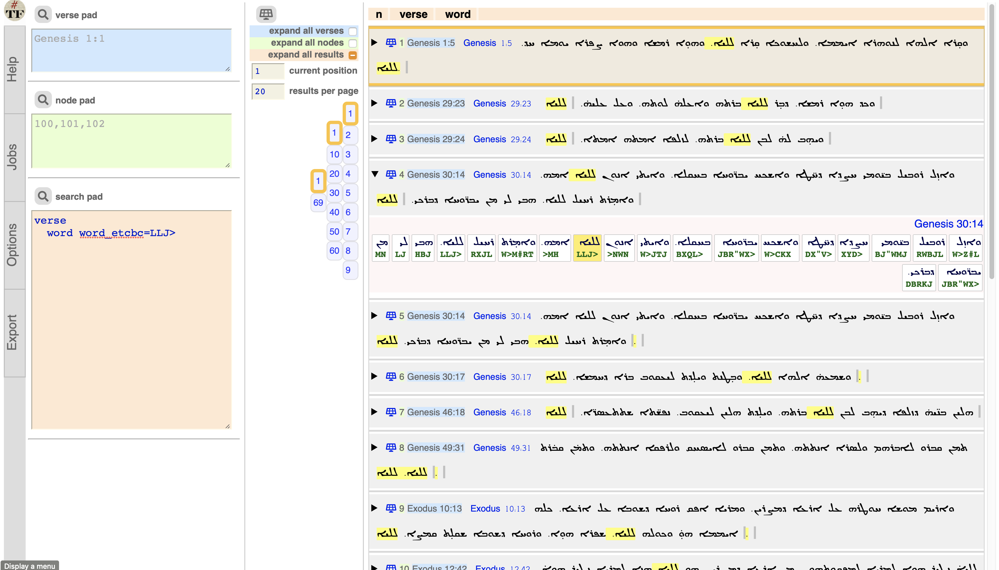

# Peshitta

This is a
[Text-Fabric](https://githubv.com/annotation/text-fabric) app
for working with the
[Peshitta](https://github.com/ETCBC/peshitta) corpus: the Syriac Old Testament.

Get started with the
[tutorial](https://nbviewer.jupyter.org/github/annotation/tutorials/blob/master/peshitta/start.ipynb).

It offers this [API](https://annotation.github.io/text-fabric/Api/App/).

